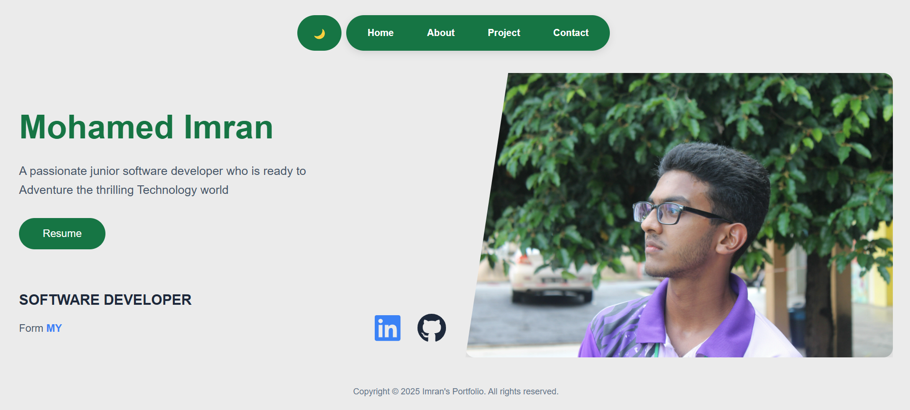

# Mohamed Imran's Portfolio

A responsive personal portfolio showcasing my projects, skills, and developer journey. Built with React and deployed on GitHub Pages.

## 🚀 Features

- Modern UI with smooth animations
- Fully responsive design
- Project showcase with descriptions
- Interactive contact form

## 🛠️ Technologies

- **Frontend**: React, CSS3
- **Deployment**: GitHub Pages
- **Icons**: React Icons
- **Routing**: React Router

## 🌐 Live Demo

[View Portfolio](https://mohamedimran7868.github.io/imran-portfolio/#/)